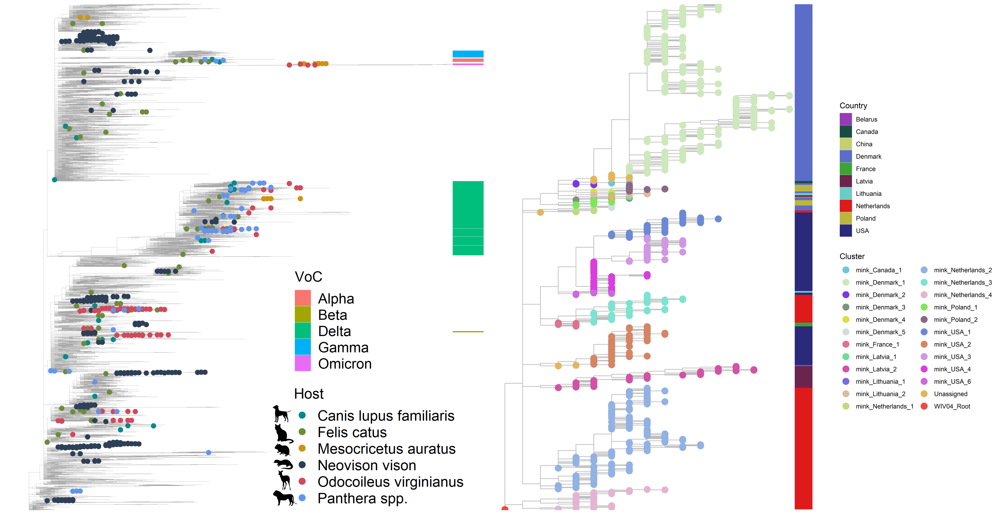

# Transmission of SARS-CoV-2 from humans to animals and potential host adaptation
Authors: Cedric C.S. Tan, Su Datt Lam, Damien Richard, Christopher Owen, Dorothea Berchtold, Christine Orengo, Suresh V. Kuchipudi, Meera Surendran Nair, Vivek Kapur, Lucy van Dorp, François Balloux

Investigating patterns of SARS-CoV-2 host adaptation following human-to-animal transmission.

* We initially analysed the presence of recurrent mutations (homoplasies) from mink-associated SARS-CoV-2 sequences in late 2020. This work was associated with a BioRXIV [preprint](https://www.biorxiv.org/content/10.1101/2020.11.16.384743v1). 
* Following reports of human-to-deer transmission in the USA, we re-analysed deer and mink sequences to provide a more comprehensive understanding of the extent of animal-specific adaptation.

